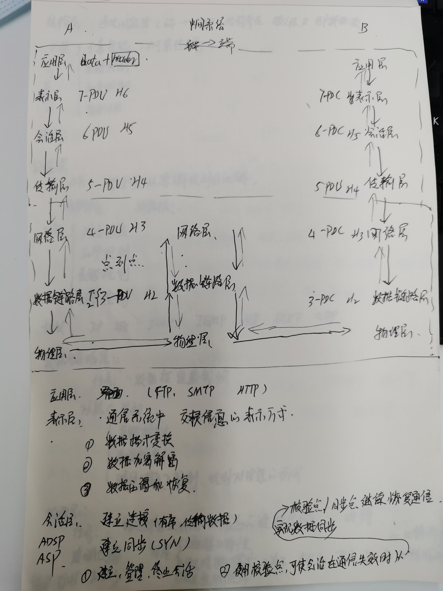
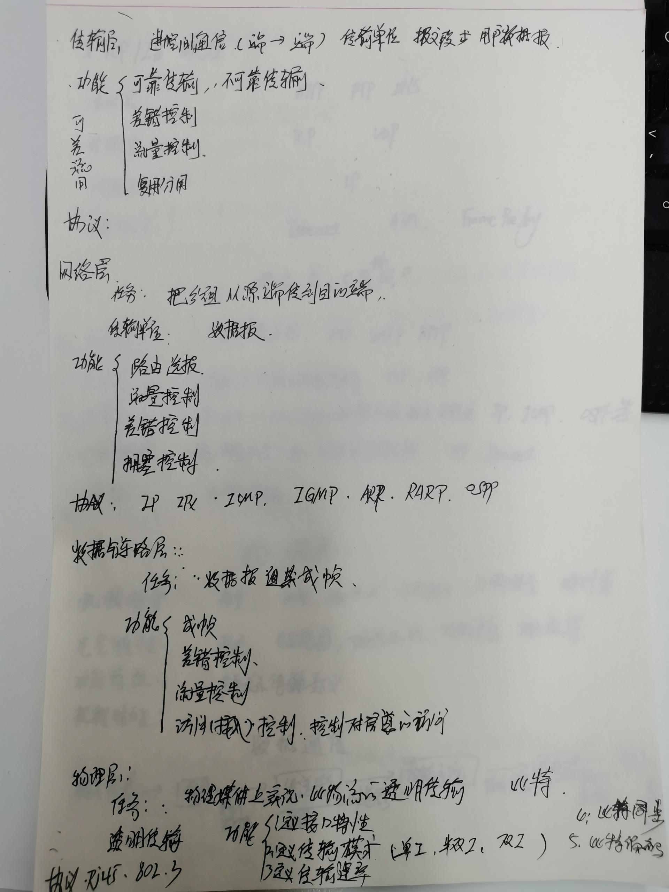

### 网络编程就是编写程序使两台联网的计算机相互交换数据。

### 1. 什么是socket?
```text
       socket 被翻译为“套接字”，它是计算机之间进行通信的一种约定或一种方式。通过 socket 这种约定，一台计算机可以接收其他计算机的数据，也可以向其他计算机发送数据
   
   通过 socket() 函数来创建一个网络连接，或者说打开一个网络文件，socket() 的返回值就是文件描述符。有了文件描述符，我们就可以使用普通的文件操作函数来传输数据了，例如：
   
   用 read() 读取从远程计算机传来的数据；
   
   用 write() 向远程计算机写入数据。

   Windows 也有类似“文件描述符”的概念，但通常被称为“文件句柄”
```


### 2. Internet 套接字

1. 流格式套接字（SOCK_STREAM）
    
    SOCK_STREAM 是一种可靠的、双向的通信数据流，数据可以准确无误地到达另一台计算机，如果损坏或丢失，可以重新发送。
    ```text
        应用场景:浏览器所使用的 http 协议就基于面向连接的套接字，因为必须要确保数据准确无误，否则加载的 HTML 将无法解析。
        SOCK_STREAM 有以下几个特征：
            1. 数据在传输过程中不会消失；
            2. 数据是按照顺序传输的；
            3. 数据的发送和接收不是同步的（有的教程也称“不存在数据边界”）。
        流格式套接字可以达到高质量的数据传输是因为它使用了 TCP 协议（The Transmission Control Protocol，传输控制协议），
        TCP 协议会控制你的数据按照顺序到达并且没有错误
        
        “TCP/IP” TCP 用来确保数据的正确性，IP（Internet Protocol，网络协议）用来控制数据如何从源头到达目的地，也就是常说的“路由”
        
        “数据的发送和接收不同步”
        格式套接字的内部有一个缓冲区（也就是字符数组），通过 socket 传输的数据将保存到这个缓冲区。接收端在收到数据后并不一定立即读取，只要数据不超过缓冲区的容量，接收端有可能在缓冲区被填满以后一次性地读取，也可能分成好几次读取
    ```
2. 数据报格式套接字（SOCK_DGRAM）
    数据报格式套接字（Datagram Sockets）也叫“无连接的套接字”，在代码中使用 SOCK_DGRAM 表示。
    ```text
       应用场景: QQ 视频聊天和语音聊天就使用 SOCK_DGRAM 来传输数据
       数据报套接字也使用 IP 协议作路由，但是它不使用 TCP 协议，而是使用 UDP 协议（User Datagram Protocol，用户数据报协议）
       计算机只管传输数据，不作数据校验，如果数据在传输中损坏，或者没有到达另一台计算机，是没有办法补救的。也就是说，数据错了就错了，无法重传。
   
       可以将 SOCK_DGRAM它有以下特征：
        1. 强调快速传输而非传输顺序；
        2. 传输的数据可能丢失也可能损毁；
        3. 限制每次传输的数据大小；
        4. 数据的发送和接收是同步的（有的教程也称“存在数据边界”）
    ```

### 网络的七层模型
   
   
   
   
### 3. TCP/IP协议族
  TCP/IP 模型包含了 TCP、IP、UDP、Telnet、FTP、SMTP 等上百个互为关联的协议，其中 TCP 和 IP 是最常用的两种底层协议，所以把它们统称为“TCP/IP 协议族”
  “TCP/IP模型”中所涉及到的协议称为“TCP/IP协议族”
  
  
    IP地址是 Internet Protocol Address 的缩写，译为“网际协议地址”。
    MAC 地址是 Media Access Control Address 的缩写，直译为“媒体访问控制地址”，也称为局域网地址（LAN Address），以太网地址（Ethernet Address）或物理地址（Physical Address）。
      
