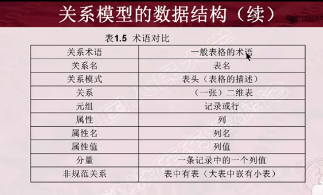
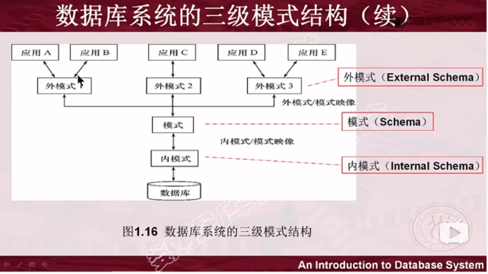
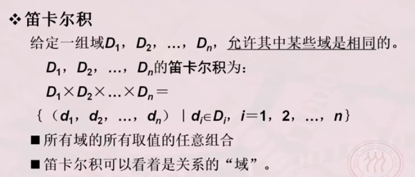
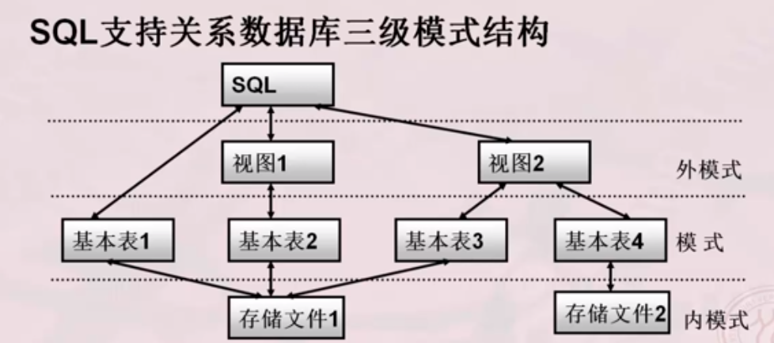
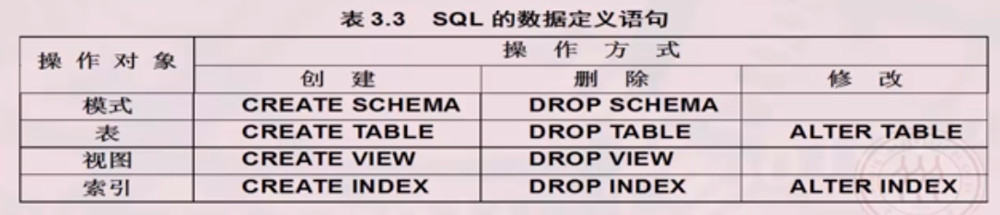

#1模型
###1.1关系模型

    关系(Relation):    一个关系对应通常说的一张表
    
    元组(Tuple):      表中的一行即为一个元组
    
    属性(Attrubute):  表中的一列即为一个属性
    
    主码(Key):        也称码键，表中的某个属性组， 它可以唯一确定一个元组
    
    域(Domain):       是一组具有相同数据类型的值得集合
    
    分量:             元组中的一个属性值
    
    关系模型:         对关系的描述
 
 

    优点：
        1. 建立在数学概念基础上
        2. 概念单一
            1》 实体和各类联系都用关系来表示
            2》 对数据的检索结果也是关系
            
    3. 关系模型的存取路径对用户透明
        具有更高的数据独立性，更好的安全保密性
        简化了程序员的工作和数据库建立开发的工作
    缺点：
        1. 存取路径对用户透明查询效率往往不如格式化数据类型
        2. 为提高性能，必须对用户的查询请求进行优化，增加了开发数据库管理系统的难度


###1.2.层次模型（格式化模型）
    1. 实体型--用记录类型描述  每个结点表示一个记录类型（实体）
    2. 属性 -- 用字段描述  每个记录类型包含若干个字段
    3. 联系 -- 用结点之间的连线表示记录类型（实体）之间的一对多的父子联系

    层次模型的定义：
        1.有且只有一个结点没有没有双亲结点，这个结点称为根结点
        2.根以外的其他结点有且只有一个双亲结点

    层次模型的数据操作：
        1.查询
        2.插入
        3.删除
        4.更新

    层次模型的完整性约束条件:
        1.无相应的双亲结点值就不能插入子女结点值
        2.如果删除双亲结点的值，则相应的子女结点的值也被同时删除
        3.更新操作时，应更新所有相应记录，以保证数据的一致性
    
    层次模型的优点：
        1.层次模型的数据结构比较简单清晰；
        2.层次数据库的查询效率高,性能优于关系模型；
        3.层次数据库模型提供了良好的完整性支持。
        
    层次模型的缺点：
    　　1.现实世界中很多联系是非层次性的，如结点之间具有多对多联系。
        2.一个结点具有多个双亲等，层次模型表示这联系的方法很笨拙，对插入和删除操作的限制比较多，应用程序编写较复杂。
    　　3.查询子女结点必须通过双亲结点。
        4.层次数据库的命令趋于程序化


###1.3.网状模型（格式化模型）
    1. 实体型--用记录类型描述  每个结点表示一个记录类型（实体）
    2. 属性 -- 用字段描述  每个记录类型包含若干个字段
    3. 联系 -- 用结点之间的连线表示记录类型（实体）之间的一对多的父子联系

    网状模型的定义：
        1.允许一个以上的结点无双亲
        2. 一个结点可以有多余一个的双亲

    网状模型的完整性约束条件:
        1.导航式的查询语言和增删改操作语言（即趋于过程化的）
        2. 完整性约束条件不严格
            1》 允许插入尚未确定双亲结点值的子女结点值
            2》 允许只删除双亲结点值

    网状模型的优点：
        1.网状模型简介表示多对多联系（方法： 将多对多联系分解成一对多联系）
        1.能够更为直接地描述现实世界。如一个结点可以有多个双亲，结点之间可以有多种联系。
        2.具有良好的性能，存取效率较高。

    网状模型的缺点
        1.结构比较复杂，而且应用环境越大，数据库的结构就变得越复杂，不利于最终用户掌握
        2.其数据定义语言(DDL)、数据操作语言(DML)复杂，用户不容易使用


###1.4.面向对象数据模型（对象模型）   
###1.5.对象关系数据模型（对象模型）
###1.6.半结构化数据模型（）   xml
###1.7.非结构化数据模型， 图模型


#2数据库系统

###2.1. 数据库系统的结构

####2.1.1. 从数据库应用开发人员角度看：
   数据库系统采用三级模式结构，是数据库系统内部的系统结构
   
  
   
- 1.基本概念：
    - 1.1.模式（Schema） 也称逻辑模式:
        -  是对数据库逻辑结构和特征的描述
        -  是型的描述， 不涉及具体值
        -  模式是相对稳定的
        
    - 1.2.实例（Instance）:
        - 数据库某一时刻的状态--模式的一个具体值
        - 同一模式可以有很多实例
        - 实例岁数据库中的数据的更新而变动
            
    - 1.3.外模式：
        - 数据库用户使用的局部数据的逻辑结构和特征的描述
        - 数据库用户的数据视图， 是与某一应用有关的数据的逻辑表示
        - 外模式与模式的关系：
            - 外模式桐城市模式的子集
        - 外模式与应用的关系：
            - 一个外模式可以为多个应用系统所使用的， 一个应用程序只能使用一个外模式
        - 外模式的用途：
            - 每个用户只能看见和访问所对对应外模式中的数据， 简化用户视图
            - 保证数据库安全性的一个有力措施
            
    - 1.4.内模式（也称存储模式）：
        - 一个数据库只有一个内模式
        - 是数据物理结构和存储方式的描述
        - 是数据在数据库内部的表示方式
            - 记录存储方式：
               例如， 顺序存储， 堆存储， 按hash方法存储等 
            - 索引的组织方式：
                例如 B+树， Bitmap， Hash
            - 数据的压缩存储
            - 数据是否加密
            - 数据存储激励结构的规定--如定长/变长， 记录是否可跨页存放等

- 2.数据库的二级映象(mapping)功能与数据独立性
    - 二级映象是三个抽象层次（即三级模式）的联系和转换  
    
    - 分为以下两种：
        1.  外模式--》模式映象
        2.  模式--》内模式映象
        
    - 二级映象作用：
        1. 保证了应用程序的稳定性
        2. 从程序为中心--发展为以数据中心
        3. 数据的存取由数据库管理系统管理

    - 外模式--》模式映象：
        - 每个外模式有一个外模式/模式映像定义外模式与模式之间的对应关系
        - 映像定义通常包含在各外模式的描述中
        - 保证数据的逻辑独立性
            - 应用程序是依据数据的外模式编写的，应用程序不必修改保证了数据与程序的逻辑独立性，简称数据的逻辑独立性
    
    - 模式--》内模式的映像：
        - 定义了数据全局逻辑结构与存储结构之间的对应关系。 说明某个逻辑记录对应何种存储结构
        - 数据库中模式、内模式映象是唯一的
        - 该映像定义通常包含在模式描述中
        - 保证数据的物理独立性

####2.1.2.从数据库最终用户角度看：

- 数据库系统的结构有：
    1. 单用户结构
    2. 主从式结构
    3. 分布式结构
    4. 客户-服务器
    5. 浏览器-应用服务器/数据服务器
         
###2.2.数据库系统的组成

- 1.数据库管理员（DBA）
    - 负责参与确定数据库中的信息内容和结构
    - 参与数据库的存储结构和存储策略的设计
    - 参与确定数据安全性要求和完整性约束条件
    - 监控数据库的使用和运行
    - 数据库的改进和重组

- 2.系统分析员
    - 负责应用系统的需求分析和规范说明
    - 与用户及数据库管理员结合，确定系统的软硬件配置
    - 参与数据库系统设计

- 3.数据库设计人员
    - 参与用户需求调查和系统分析
    - 确定数据库中的数据
    - 设计数据库各级模式

- 4.应用程序员

---

* 关系  -- 实体与实体之间的联系
* 域    -- 一组具有相同数据类型的值得集合
* 笛卡尔积  -- 
*  空值就是 “不知道”， “没意义”的值


###2.3.SQL语言：


```
基本表：
    本身独立存在的表
    sql中一个关系就对应一个基本表
    一个（或多个）基本表对应一个存储文件
    一个表可以带若干索引
文件存储：
    逻辑结构组成了关系数据库的内模式
    物理结构对用户是隐蔽的
视图：
    从一个或几个基本表导出的表
    数据库中只存放视图的定义而不村放视图的对应数据
    视图是一个虚表
    用户可以在仕途上再定义视图
```
####2.3.1数据定义：
sql的数据定义功能： 定义各种数据库的“对象”


- 1.定义模式
    - CREATE SCHEMA<模式名>AUTHORIZATION<用户名>;
    - 定义模式实际上是定义了一个命名空间，在这个空间中可以进一步定义该模式包含的数据库对象，例如基本表，视图，和索引。

    例如：
    ```sql
    
        CREATE SCHEMA TEST AUTHORIZATION ZHANG
        CREATE TABLE TAB1(COL1 SMALLINT,
                        COL2 INT,
                        COL3 CHAR(20),
                        COL4 NUMBERIC(10,3),
                        COL5 DECIMAL(5,2)
                        );
    ```

- 2.删除模式
    - DROP SCHEMA<函数名><CASCADE│RESTRICT>;
    
    - CASCADE级联，表示在删除模式的同时把该模式下所有的数据库对象全部删除；
    
    - RESTRICT限制，表示如果该模式中已经定义了下属的数据库对象（如表、图等），则拒绝该删除语句的执行。

    例如：
    ```sql
    DROP SCHEMA ZHANG CASCADE; #语句删除了模式ZHANG，同时，该模式中已经定义的TAB1也被删除。
    ```    

- 3.基本表定义
    ```text
        CREATE TABLE 表名(
            列名  数据类型  列级完整性约束条件，
            列名  数据类型  列级完整性约束条件，
            ......
            列名  数据类型  列级完整性约束条件，
            表级完整性约束条件
        )；
    ```
    * 例如：
        创建一个“学生”表Student。
    ```sql
        CREATE TABLE Student(
            Sno CHAR(9) PRIMARY KEY,
            Sname CHAR(20) UNIQUE,
            Ssex CHAR(2),
            Sage SMALLINT,
            Sdept CHAR(20)
            );
    ```

- 4.修改基本表
```text
    ALTER TABLE <表名>
    [ADD [COLUMN] <新列名><数据类型>[完整性约束条件]]
    [ADD <表级完整性约束>]
    [DROP [COLUMN] <列名> [CASCADE|RESTRICT]]
    [DROP CONSTRAINT <完整性约束条件> [CASCADE|RESTRICT]]
    [ALTER COLUMN <列名><数据类型>];
```
例如：
```sql
    #向Student表增加“入学时间”列，其数据类型为日期型。
    ALTER TABLE Student ADD S_entrance DATE;

    #将年龄的数据类型由字符型（假设原来为字符型）改为整数。
    ALTER TABLE Student ALTER COLUMN Sage INT;

    #增加课程名称必须取唯一值的约束条件。
    ALTER TABLE Course ADD UNIQUE(Cname);
```

- 5.删除基本表
```text
    DROP TABLE <表名> [RESTRICT|CASCADE];
    若选择RESTRICT，则该表的删除是有限制条件的。欲删除的表不能被其他表的约束所引用，不能有视图，不能有触发器，不能有存储过程或函数等。
    若选择CASCADE，则该表的删除没有限制条件。在删除表的同时，相关的依赖对象，即将被一起删除。

```
例如：
    删除Student表
```sql
    DROP TABLE Student CASCADE;
```


- 6.索引的定义：
    - 建立索引目的： 加快查询速度
    - 常见索引：
        - 顺序文件上的索引
        - B+树索引
        - 散列索引
        - 位图索引
    - 特点：
        - B+树索引具有动态平衡的优点
        - HASH索引具有查找速度快的特点

```text
    CREATE [UNIQUE] [CLUSTER] INDEX <索引名> ON <表名>(<列名> [<次序>] [,<列名>[<次序>]]...);
    UNIQUE表明此索引的每一个索引值只对应唯一的数据记录。
    CLUSTER表示要建立的索引是聚族索引。
    次序： 指定索引排列次序 升序：ASC 降序：DESC 缺省值：ASC
```
例如：
    为学生-课程数据库中的Student、Course和SC三个表建立索引。其中Student表按学号升序建唯一索引，Course表按课程号升序建唯一索引，SC表按学号升序和课程号降序建唯一索引。
```sql
    CREATE UNIQUE INDEX Stusno ON Student(Sno);
    CREATE UNIQUE INDEX Coucno ON Course(Cno);
    CREATE UNIQUE INDEX SCno ON SC(Sno ASC,Cno DESC);
```

- 7.修改索引
```text
ALTER INDEX <旧索引名> RENAME TO <新索引名>;
```
例如：
    将SC表的SCno索引名改为SCSno。
```sql
ALTER INDEX SCno RENAME TO SCSno;
```
           
- 8.删除索引
    DROP INDEX <表名> <索引名>;
    
