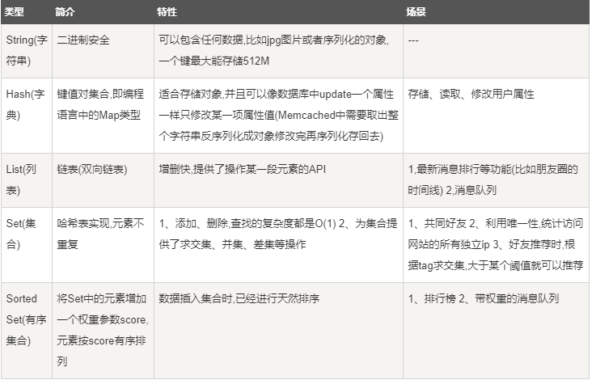

MySQL 
### 一. mysql
#### 安装
   [MySQL下载地址](https://dev.mysql.com/downloads/mysql/)
   
   mysql 登录 
   <pre>
   远程登录：
    mysql -h 主机名 -u 用户名 -p
    -h : 指定客户端所要登录的 MySQL 主机名, 登录本机(localhost 或 127.0.0.1)该参数可以省略;
    -u : 登录的用户名;
    -p : 告诉服务器将会使用一个密码来登录, 如果所要登录的用户名密码为空, 可以忽略此选项。
    本地登录：
        mysql -u root -p    按回车确认 输入密码
   </pre>
   windows mysql 启动及关闭

#### SQL中基本的语言分类


#### MYSQL数据结构(数据类型)
mysql 主要分为6种类型
1. 整形
    <pre>
    tinyint(m)	1个字节  范围(-128~127)
    smallint(m)	2个字节  范围(-32768~32767)
    mediumint(m)	3个字节  范围(-8388608~8388607)
    int(m)	4个字节  范围(-2147483648~2147483647)
    bigint(m)	8个字节  范围(+-9.22*10的18次方)
    </pre>
    取值范围如果加了unsigned，则最大值翻倍，如tinyint unsigned的取值范围为(0~256)。
    int(m)里的m是表示SELECT查询结果集中的显示宽度，并不影响实际的取值范围。
2. 浮点数（fload和double）
    <pre>
    float(m,d)	单精度浮点型    8位精度(4字节)     m总个数，d小数位
    double(m,d)	双精度浮点型    16位精度(8字节)    m总个数，d小数位
    </pre>
    设一个字段定义为float(5,3)，如果插入一个数123.45678,实际数据库里存的是123.457，但总个数还以实际为准，即6位。

3. 定点数
    <pre>
    浮点型在数据库中存放的是近似值，而定点类型在数据库中存放的是精确值。
    decimal(m,d) 参数m<65 是总个数，d<30且 d<m 是小数位。
    </pre>
   
4. 字符串(char,varchar,_text)
    <pre>
    char(n)	固定长度，最多255个字符
    varchar(n)	固定长度，最多65535个字符
    tinytext	可变长度，最多255个字符
    text	可变长度，最多65535个字符
    mediumtext	可变长度，最多2的24次方-1个字符
    longtext	可变长度，最多2的32次方-1个字符
    </pre>
    char和varchar：
    
        1.char(n) 若存入字符数小于n，则以空格补于其后，查询之时再将空格去掉。所以char类型存储的字符串末尾不能有空格，varchar不限于此。
        2.char(n) 固定长度，char(4)不管是存入几个字符，都将占用4个字节，varchar是存入的实际字符数+1个字节（n<=255）或2个字节(n>255)，所以varchar(4),存入3个字符将占用4个字节。
        3.char类型的字符串检索速度要比varchar类型的快。
    
    varchar和text：
    
        1.varchar可指定n，text不能指定，内部存储varchar是存入的实际字符数+1个字节（n<=255）或2个字节(n>255)，text是实际字符数+2个字节。
        2.text类型不能有默认值。
        3.varchar可直接创建索引，text创建索引要指定前多少个字符。varchar查询速度快于text,在都创建索引的情况下，text的索引似乎不起作用。

5. 二进制数据(_Blob)
    BLOB 是一个二进制大对象，可以容纳可变数量的数据。有 4 种 BLOB 类型：TINYBLOB、BLOB、MEDIUMBLOB 和 LONGBLOB。它们区别在于可容纳存储范围不同。
    <pre>
        1._BLOB和_text存储方式不同，_TEXT以文本方式存储，英文存储区分大小写，而_Blob是以二进制方式存储，不分大小写。
        2._BLOB存储的数据只能整体读出。
        3._TEXT可以指定字符集，_BLO不用指定字符集。
    </pre>
6. 日期时间类型
    <pre>
    date	日期 '2008-12-2'
    time	时间 '12:25:36'
    datetime	日期时间 '2008-12-2 22:06:44'
    timestamp	自动存储记录修改时间
    </pre>

#### MYSQL 关键字
<pre>
    NULL	数据列可包含NULL值
    NOT NULL	数据列不允许包含NULL值
    DEFAULT	默认值
    PRIMARY KEY	主键   用于定义列为主键。 您可以使用多列来定义主键，列间以逗号分隔。
    AUTO_INCREMENT	自动递增，适用于整数类型
    UNSIGNED	无符号
    CHARACTER SET name	指定一个字符集
</pre>
    
#### MYSQL 基本操作一（mysql用户级）
<pre>
    MYSQL 8.0
    1. 开启关闭mysql指令(管理员权限):
        windows下:
            如果没有服务 那是mysql 没有初始化执行 mysql install 即可
            关闭mysql服务 net stop mysql80 (windows + R  services.msc 查看mysql name)
            开启mysql服务 net start mysql80 
    2. 登录：
        mysql -h host  -uname -p pwd
        
    3. mysql 用户设置
        1. 添加一个用户
        create user "name"@"host" identified by "pwssword";
        例如：
        create user "root"@"%" identified by "root";
        2. 用户授权：
            GRANT privileges ON databasename.tablename TO 'username'@'host'
            -- 授予myuser用户全局级全部权限：
            GRANT ALL PRIVILEGES ON *.* TO 'myuser'@'%' IDENTIFIED BY 'mypass' WITH GRANT OPTION;
            WITH GRANT OPTION 这个选项表示该用户可以将自己拥有的权限授权给别人。注意：经常有人在创建操作用户的时候不指定WITH GRANT OPTION选项导致后来该用户不能使用GRANT命令创建用户或者给其它用户授权
            例如：
             GRANT SELECT, INSERT ON mq.* TO 'root'@'localhost';
             GRANT ALL ON mq.* TO 'root'@'localhost';
            privileges - 用户的操作权限,如SELECT , INSERT , UPDATE 等(详细列表见该文最后面).如果要授予所的权限则使用ALL.;
        3. 创建用户并授权
            grant all privileges on mq.* to test@localhost identified by '1234';
            flush privileges;
        4. 用户设置更改密码:
            alter user 'name'@'host' identified by 'password'
            alter user 'yiyumo'@'localhost' identified by 'yiyumo';
            flush privileges;
        5. 撤销用户权限
            revoke privileges on databasename.tablename from 'username'@'host';
            REVOKE ALL PRIVILEGES FROM myuser;
</pre> 


#### MYSQL 基本操作二（关于库和表的操作）
<pre>
    1. 创建mysql库
        CREATE DATABASE 数据库名;
        使用root用户登录，root用户拥有最高权限，可以使用 mysql mysqladmin 命令来创建数据库。
        mysqladmin -u root -p create 数据库名;
    2. 删除数据库
        drop database 数据库名;
        mysqladmin 删除数据库
        mysqladmin -u root -p drop 数据库名;
    3. 创建数据表
        CREATE TABLE table_name (column_name column_type);
        CREATE TABLE 表名 (
            属性名 数据类型 [完整约束条件],
            属性名 数据类型 [完整约束条件],
            ...
            ...
            属性名 数据类型 [完整约束条件]
        );
        实例：
            CONSTRAINT 外键别名 FOREIGN KEY(属性1,属性2,....属性n) REFERENCES 表名(属性1',属性2',...属性n')
            CREATE TABLE teacher (
            id int primary key,
            stu_id int,
            name varchar(20),
            constraint stuid foreing key(stu_id) references students(id)  # 外键
            );
    4. 修改表名
        ALTER TABLE 旧表名 RENAME 新表名;
        alter table tablename rename new_tablename;
        修改字段名：
            ALTER TABLE 表名 CHANGE 旧属性名 新属性名 新数据类型;
        增加字段：
            ALTER TABLE 表名 ADD 属性名1 数据类型 [完整性约束条件] [FIRST | AFTER 属性名2];
            “属性名1”参数指需要增加的字段的名称；“FIRST”参数是可选参数，其作用是将新增字段设置为表的第一个字段；“AFTER”参数也是可选的参数，其作用是将新增字段添加到“属性名2”后面；“属性名2”当然就是指表中已经有的字段
        删除字段：
            ALTER TABLE 表名 DROP 属性名;
        
        删除表的外键约束
        ALTER TABLE 表名 DROP FOREIGN KEY 外键别名;
    5. 查看表结构
          DESCRIBE 表名;
          查看表详细结构语句SHOW CREATE TABLE
          实例：
            desc student;
    6. 插入数据：
        INSERT INTO table_name ( field1, field2,...fieldN )VALUES( value1, value2,...valueN );
        如果数据是字符型，必须使用单引号或者双引号，如："value"。
    7. 查询数据
        SELECT column_name,column_name  FROM table_name  [WHERE Clause] [LIMIT N][ OFFSET M]
    8. 更新数据
        UPDATE table_name SET field1=new-value1, field2=new-value2 [WHERE Clause]
    9. 删除数据
        DELETE FROM table_name [WHERE Clause]

        
</pre>      


#### MYSQL 基本操作二（表的操作之数据操作）     
<pre>
    1. where 字句
        WHERE 子句的字符串比较是不区分大小写的。 你可以使用 BINARY 关键字来设定 WHERE 子句的字符串比较是区分大小写的。
    
    2. LIKE 子句
        SELECT field1, field2,...fieldN FROM table_name WHERE field1 LIKE condition1 [AND [OR]] filed2 = 'somevalue'
        LIKE运算符用于WHERE表达式中，以搜索匹配字段中的指定内容
        在LIKE全面加上NOT运算符时，表示与LIKE相反的意思，即选择column不包含pattern的数据记录
        LIKE通常与通配符%一起使用，%表示通配pattern中出现的内容，而不加通配符%的LIKE语法，表示精确匹配，其实际效果等同于 = 等于运算符
    
    3. UNION 操作符
        UNION ALL只是简单的将两个结果合并后就返回。这样，如果返回的两个结果集中有重复的数据，那么返回的结果集就会包含重复的数据了。
        select * from A union all select * from B  //A B数据结构一定要一样
        
        SELECT expression1, expression2, ... expression_n FROM tables [WHERE conditions]
        UNION [ALL | DISTINCT]  SELECT expression1, expression2, ... expression_n FROM tables [WHERE conditions];
        DISTINCT: 可选，删除结果集中重复的数据。默认情况下 UNION 操作符已经删除了重复数据，所以 DISTINCT 修饰符对结果没啥影响
        ALL: 可选，返回所有结果集，包含重复数据。
    4. ORDER BY排序
        SELECT field1, field2,...fieldN FROM table_name1, table_name2... ORDER BY field1 [ASC [DESC][默认 ASC]], [field2...] [ASC [DESC][默认 ASC]]
    5. GROUP BY 分组
        GROUP BY 语句根据一个或多个列对结果集进行分组。
        SELECT column_name, function(column_name) FROM table_name WHERE column_name operator value GROUP BY column_name;
        WITH ROLLUP 可以实现在分组统计数据基础上再进行相同的统计（SUM,AVG,COUNT…）
        
        select coalesce(a,b,c);
        如果a==null,则选择b；如果b==null,则选择c；如果a!=null,则选择a；如果a b c 都为null ，则返回为null（没意义）。
    7. ON
        on条件是在生成临时表时使用的条件，它不管on中的条件是否为真，都会返回左边表中的记录。
        简单解释就是假设两个表A、B。以A表为左，B表为右。如果是ON A.key = B.key,如果符合条件那么B表的内容也会列出来
        如果不符合条件 那么A表的属性会显示，但是B表的内容就全部显示为NULL
    
    6. mysql 连接 JOIN
        INNER JOIN（内连接,或等值连接）：获取两个表中字段匹配关系的记录。
        LEFT JOIN（左连接）：获取左表所有记录，即使右表没有对应匹配的记录。
        RIGHT JOIN（右连接）： 与 LEFT JOIN 相反，用于获取右表所有记录，即使左表没有对应匹配的记录。
    7. mysql 正则表达式
        MySQL中使用 REGEXP 操作符来进行正则表达式匹配
        实例：
            查找name字段中以'st'为开头的所有数据：
            SELECT name FROM person_tbl WHERE name REGEXP '^st';
        
    
    
</pre>
#### 连接 join

#### 正则规则图


#### MYSQL 事务
1. 一个最小的不可再分的工作单元；通常一个事务对应一个完整的业务(例如银行账户转账业务，该业务就是一个最小的工作单元)
2. 在 MySQL 中只有使用了 Innodb 数据库引擎的数据库或表才支持事务。
3. 事务处理可以用来维护数据库的完整性，保证成批的 SQL 语句要么全部执行，要么全部不执行。
4. 事务用来管理 insert,update,delete 语句
<pre>
事务是必须满足4个条件（ACID）：：原子性（Atomicity，或称不可分割性）、一致性（Consistency）、隔离性（Isolation，又称独立性）、持久性（Durability）

原子性：一个事务（transaction）中的所有操作，要么全部完成，要么全部不完成，不会结束在中间某个环节。事务在执行过程中发生错误，会被回滚（Rollback）到事务开始前的状态，就像这个事务从来没有执行过一样。

一致性：在事务开始之前和事务结束以后，数据库的完整性没有被破坏。这表示写入的资料必须完全符合所有的预设规则，这包含资料的精确度、串联性以及后续数据库可以自发性地完成预定的工作。

隔离性：数据库允许多个并发事务同时对其数据进行读写和修改的能力，隔离性可以防止多个事务并发执行时由于交叉执行而导致数据的不一致。事务隔离分为不同级别，包括读未提交（Read uncommitted）、读提交（read committed）、可重复读（repeatable read）和串行化（Serializable）。

持久性：事务处理结束后，对数据的修改就是永久的，即便系统故障也不会丢失。

MYSQL 事务处理主要有两种方法：
1、用 BEGIN, ROLLBACK, COMMIT来实现
BEGIN 开始一个事务
ROLLBACK 事务回滚
COMMIT 事务确认
2、直接用 SET 来改变 MySQL 的自动提交模式:

SET AUTOCOMMIT=0 禁止自动提交
SET AUTOCOMMIT=1 开启自动提交
</pre>

#### MYSQL 索引
###### 索引也是一张表，该表保存了主键与索引字段，并指向实体表的记录。
###### mysql的索引分为单列索引(主键索引,唯索引,普通索引)和组合索引.
###### 索引分单列索引和组合索引。单列索引，即一个索引只包含单个列，一个表可以有多个单列索引，但这不是组合索引。组合索引，即一个索引包含多个列。

    普通索引
        创建索引 
            CREATE INDEX indexName ON table_name (column_name)
            /** 如果是CHAR，VARCHAR类型，length可以小于字段实际长度；如果是BLOB和TEXT类型，必须指定 length。 **/
    
        修改表结构(添加索引)
            ALTER table tableName ADD INDEX indexName(columnName)   
        删除索引的语法
            DROP INDEX [indexName] ON mytable; 
    唯一索引
        索引列的值必须唯一，但允许有空值。如果是组合索引，则列值的组合必须唯一
        创建索引
            CREATE UNIQUE INDEX indexName ON mytable(username(length)) 
        修改表结构
            ALTER table mytable ADD UNIQUE [indexName] (username(length))
    使用ALTER 命令添加和删除索引
        ALTER TABLE tbl_name ADD PRIMARY KEY (column_list): 该语句添加一个主键，这意味着索引值必须是唯一的，且不能为NULL。
        ALTER TABLE tbl_name ADD UNIQUE index_name (column_list): 这条语句创建索引的值必须是唯一的（除了NULL外，NULL可能会出现多次）。
        ALTER TABLE tbl_name ADD INDEX index_name (column_list): 添加普通索引，索引值可出现多次。
        ALTER TABLE tbl_name ADD FULLTEXT index_name (column_list):该语句指定了索引为 FULLTEXT ，用于全文索引。
    使用 ALTER 命令添加和删除主键
        主键作用于列上（可以一个列或多个列联合主键），添加主键索引时，你需要确保该主键默认不为空（NOT NULL）。
        ALTER TABLE testalter_tbl MODIFY i INT NOT NULL;
        ALTER TABLE testalter_tbl ADD PRIMARY KEY (i);
        ALTER 命令删除主键
            ALTER TABLE testalter_tbl DROP PRIMARY KEY;
    显示索引信息
        SHOW INDEX FROM table_name;
    
    组合索引
        一个表中含有多个单列索引不代表是组合索引,通俗一点讲 组合索引是:包含多个字段但是只有索引名称
        CREATE INDEX IndexName On `TableName`(`字段名`(length),`字段名`(length),...);
        使用查询的时候遵循mysql组合索引的"最左前缀",下面我们来分析一下 什么是最左前缀:及索引where时的条件要按照建立索引的时候字段的排序方式

        1、不按索引最左列开始查询（多列索引） 例如index(‘c1’, ‘c2’, ‘c3’) where ‘c2’ = ‘aaa’ 不使用索引,where `c2` = `aaa` and `c3`=`sss` 不能使用索引
        
        2、查询中某个列有范围查询，则其右边的所有列都无法使用查询（多列查询）
        
        Where c1= ‘xxx’ and c2 like = ‘aa%’ and c3=’sss’ 改查询只会使用索引中的前两列,因为like是范围查询
        
        3、不能跳过某个字段来进行查询,这样利用不到索引,比如我的sql 是 
        
        explain select * from `award` where nickname > 'rSUQFzpkDz3R' and account = 'DYxJoqZq2rd7' and created_time = 1449567822; 那么这时候他使用不到其组合索引.
        
        因为我的索引是 (nickname, account, created_time),如果第一个字段出现 范围符号的查找,那么将不会用到索引,如果我是第二个或者第三个字段使用范围符号的查找,那么他会利用索引,利用的索引是(nickname),
        
        因为上面说了建立组合索引(nickname, account, created_time), 会出现三个索引
        
    全文索引
        文本字段上(text)如果建立的是普通索引,那么只有对文本的字段内容前面的字符进行索引,其字符大小根据索引建立索引时申明的大小来规定.
        如果文本中出现多个一样的字符,而且需要查找的话,那么其条件只能是 where column lick '%xxxx%' 这样做会让索引失效
        .这个时候全文索引就祈祷了作用了
        ALTER TABLE tablename ADD FULLTEXT(column1, column2)
        有了全文索引，就可以用SELECT查询命令去检索那些包含着一个或多个给定单词的数据记录了。

```html
(一)使用索引的优点
1.可以通过建立唯一索引或者主键索引,保证数据库表中每一行数据的唯一性.
2.建立索引可以大大提高检索的数据,以及减少表的检索行数
3.在表连接的连接条件 可以加速表与表直接的相连
4.在分组和排序字句进行数据检索,可以减少查询时间中 分组 和 排序时所消耗的时间(数据库的记录会重新排序)
5.建立索引,在查询中使用索引 可以提高性能

(二)使用索引的缺点
1.在创建索引和维护索引 会耗费时间,随着数据量的增加而增加
2.索引文件会占用物理空间,除了数据表需要占用物理空间之外,每一个索引还会占用一定的物理空间
3.当对表的数据进行 INSERT,UPDATE,DELETE 的时候,索引也要动态的维护,这样就会降低数据的维护速度,(建立索引会占用磁盘空间的索引文件。一般情况这个问题不太严重，但如果你在一个大表上创建了多种组合索引，索引文件的会膨胀很快)。


(三)使用索引需要注意的地方

在建立索引的时候应该考虑索引应该建立在数据库表中的某些列上面 哪一些索引需要建立,哪一些所以是多余的.
一般来说,
1.在经常需要搜索的列上,可以加快索引的速度
2.主键列上可以确保列的唯一性
3.在表与表的而连接条件上加上索引,可以加快连接查询的速度
4.在经常需要排序(order by),分组(group by)和的distinct 列上加索引 可以加快排序查询的时间,  (单独order by 用不了索引，索引考虑加where 或加limit)
5.在一些where 之后的 < <= > >= BETWEEN IN 以及某个情况下的like 建立字段的索引(B-TREE)

6.like语句的 如果你对nickname字段建立了一个索引.当查询的时候的语句是 nickname lick '%ABC%' 那么这个索引讲不会起到作用.而nickname lick 'ABC%' 那么将可以用到索引

7.索引不会包含NULL列,如果列中包含NULL值都将不会被包含在索引中,复合索引中如果有一列含有NULL值那么这个组合索引都将失效,一般需要给默认值0或者 ' '字符串

8.使用短索引,如果你的一个字段是Char(32)或者int(32),在创建索引的时候指定前缀长度 比如前10个字符 (前提是多数值是唯一的..)那么短索引可以提高查询速度,并且可以减少磁盘的空间,也可以减少I/0操作.

9.不要在列上进行运算,这样会使得mysql索引失效,也会进行全表扫描

10.选择越小的数据类型越好,因为通常越小的数据类型通常在磁盘,内存,cpu,缓存中 占用的空间很少,处理起来更快


(四)什么情况下不创建索引

1.查询中很少使用到的列 不应该创建索引,如果建立了索引然而还会降低mysql的性能和增大了空间需求.
2.很少数据的列也不应该建立索引,比如 一个性别字段 0或者1,在查询中,结果集的数据占了表中数据行的比例比较大,mysql需要扫描的行数很多,增加索引,并不能提高效率
3.定义为text和image和bit数据类型的列不应该增加索引,
4.当表的修改(UPDATE,INSERT,DELETE)操作远远大于检索(SELECT)操作时不应该创建索引,这两个操作是互斥的关系
```

#### MYSQL 临时表 复制表 元数据
1. 临时表
 临时表主要用于对大数据量的表上作一个子集，提高查询效率。
<pre>
    临时表只在当前连接可见，当关闭连接时，Mysql会自动删除表并释放所有空间。因此在不同的连接中可以创建同名的临时表，并且操作属于本连接的临时表。
    创建临时表的语法与创建表语法类似，不同之处是增加关键字TEMPORARY，如：
    CREATE TEMPORARY TABLE 表名 (…. )
    删除临时表
    DROP TEMPORARY TABLE IF EXISTS temp_tb;
    临时表在 memory、myisam、merge或者innodb上使用，并且不支持mysql cluster簇)；
     
    不能使用rename来重命名临时表。但是可以alter table rename代替：
             　mysql>ALTER TABLE orig_name RENAME new_name;

　　*  可以复制临时表得到一个新的临时表，如：
                mysql>create temporary table new_table select * from old_table;
　　*  但在同一个query语句中，相同的临时表只能出现一次。如：
               可以使用：mysql> select * from temp_tb;
               但不能使用：mysql> select * from temp_tb, temp_tb as t;
               错误信息：   ERROR 1137 (HY000): Can't reopen table: 'temp_tb'
        同样相同临时表不能在存储函数中出现多次，如果在一个存储函数里，用不同的别名查找一个临时表多次，或者在这个存储函数里用不同的语句查找，都会出现这个错误。
　　*  但不同的临时表可以出现在同一个query语句中，如临时表temp_tb1, temp_tb2：
                 Mysql> select * from temp_tb1, temp_tb2;
        临时表可以手动删除：
                 DROP TEMPORARY TABLE IF EXISTS temp_tb;
</pre>
MYSQL 复制表
<pre>
SHOW CREATE TABLE 表名; # 获取创建表的结构
CREATE TABLE 表名  #创建表
</pre>
<pre>
只复制表结构到新表
create table 新表 like 旧表 
复制表结构及数据到新表
create table新表 select * from 旧表 
</pre>


MYSQL 元数据

###### 所谓元数据，就是表示数据本身或关系的数据，这些数据会有点奇怪，一般来说，只要不是我们存储到数据库里的数据，大多都可以理解为元数据描述数据库的任何数据—作为数据库内容的对立面—是元数据。

#### MYSQL 序列使用
###### MySQL 序列是一组整数：1, 2, 3, ...，由于一张数据表只能有一个字段自增主键， 如果你想实现其他字段也实现自动增加，就可以使用MySQL序列来实现
MySQL 中最简单使用序列的方法就是使用 MySQL AUTO_INCREMENT 来定义列。
<pre>
获取AUTO_INCREMENT值
select last_insert_id();   获取的当前最大的id值
</pre>
重置序列
###### 如果你删除了数据表中的多条记录，并希望对剩下数据的AUTO_INCREMENT列进行重新排列，那么你可以通过删除自增的列，然后重新添加来实现
```
1、直接重置autoIncrement的值
语法格式：ALTER TABLE table_name AUTO_INCREMENT = 1;

2、通过truncate table 完成
TRUNCATE TABLE table_name;
truncate table 不仅是删除表里面的数据，而且还会清空表里面主键的标识。也就是说使用过truncate table 的表在重新写入数据的时候，标识符会从0或1重新开始（看你设置的种子号）。
delete * from就是仅仅能删除数据，不能清空标识。不过delete * from可以后面加Where truncate table却不能加Where。。

3、删除表，然后重建表
DROP TABLE table_name;
CREATE TABLE table_name { ... };

4、删除主键，再添加主键和序列
 ALTER  TABLE  table_name  MODIFY  id  int; //去掉auto_increment
 ALTER  TABLE  table_name  DROP  PRIMARY   KEY ;
ALTER  TABLE  table_name  ADD  PRIMARY  KEY(id); //添加主键
ALTER  TABLE  table_name  MODIFY  id   int  AUTO_INCREMENT;//加入自动增加

或者直接删除主键id字段
alter table insect drop id;
alter table insect  add id int unsigned not null auto_increment first add primary key(id);
```
```textmate
truncate table 和delete * from的区别
1、DROP删表，表结构将删了，当然数据也不存在了
2、TRUNCATE和DELETE删数据，表结构还在
3、DELETE可以带条件删除，TRUNCATE是全部删除
4、DELETE删除会写日志，TRUNCATE不写
5、DELETE效率低，数据可以恢复，TRUNCATE效率高，数据不可恢复

```

#### MYSQL 数据导入导出
###### 查看 secure_file_priv 地址
```sql
show global variables like '%secure%';
```
###### 导出文件
```sql
select * from table_name  info outfile '存储地址'
```


#### MYSQL 处理重复数据
防止表中出现重复数据

    MySQL 数据表中设置指定的字段为 PRIMARY KEY（主键） 或者 UNIQUE（唯一） 索引来保证数据的唯一性。
    INSERT IGNORE INTO 当插入数据时，在设置了记录的唯一性后，如果插入重复数据，将不返回错误，只以警告形式返回。 而 REPLACE INTO 如果存在 primary 或 unique 相同的记录，则先删除掉。再插入新记录。

#### SQL注入
###### 所谓SQL注入，就是通过把SQL命令插入到Web表单递交或输入域名或页面请求的查询字符串，最终达到欺骗服务器执行恶意的SQL命令。

mysql 导入导出
<pre>
查看导出（位置）权限
 show variables like '%secure_file_priv%';
 
</pre>

### 2. redis

1. redis的数据结构？
redis 数据类型（五种）
string（字符串）
hash（哈希）
list（列表）
set（集合）
zset（有序集合）

<pre>
    1. string:
         Redis 最基本的数据类型，一个 key 对应一个 value, string 类型的值最大能存储 512MB
         string 类型是二进制安全的
         例如：
            set a "redis study"
            get a
    2. hash 
          hash 是一个键值(key=>value)对集合。
          hash 是一个 string 类型的 field 和 value 的映射表，hash 特别适合用于存储对象
          每个 hash 可以存储 2^32 -1 键值对（40多亿）
         例如：
            HMSET runoob field1 "Hello" field2 "World"
            HGET runoob field1
            HGET runoob field2
    3. list
        Redis 列表是简单的字符串链表
        列表最多可存储 2^32 - 1 元素 (4294967295, 每个列表可存储40多亿)。
        实例：
            LPUSH lista 1 2 3 4 5 
            LRANGE lista 0 -1
            Lpush——先进后出，在列表头部插入元素
            Lrange——出栈，根据索引，获取列表元素
    4. set
        Redis 的 Set 是 string 类型的无序集合。
        集合内元素具有唯一性
        集合是通过哈希表实现的，所以添加，删除，查找的复杂度都是 O(1)
        实例：
            添加一个 string 元素到 key 对应的 set 集合中，成功返回 1，如果元素已经在集合中返回 0
            sadd key member
    5. zset
        Redis zset 和 set 一样也是string类型元素的集合,且不允许重复的成员。
        不同的是每个元素都会关联一个double类型的分数。redis正是通过分数来为集合中的成员进行从小到大的排序。
        zset的成员是唯一的,但分数(score)却可以重复。
        实例：
        zadd key score member
        
</pre>
数据类型场景介绍



### 3. vue


