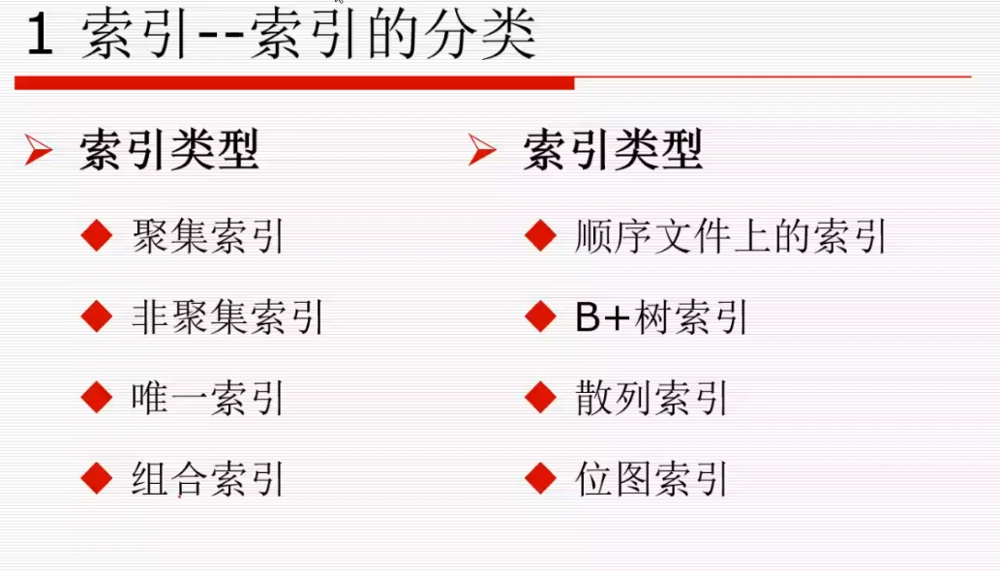
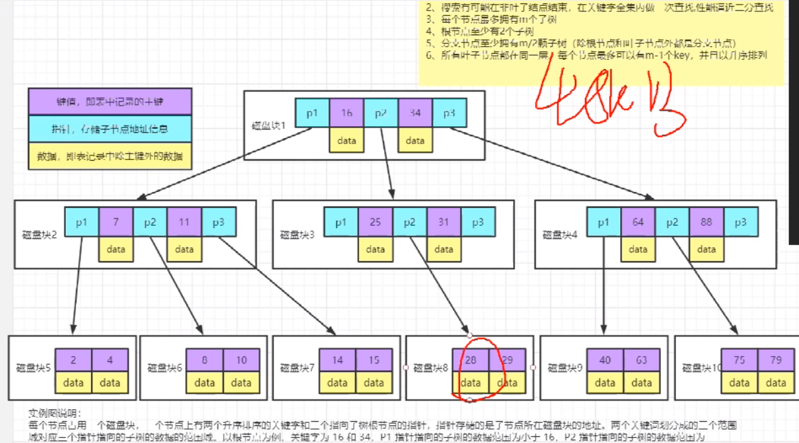
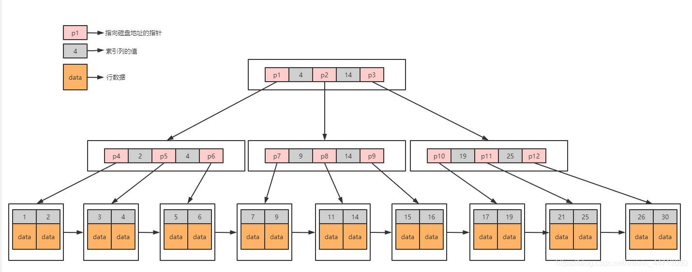
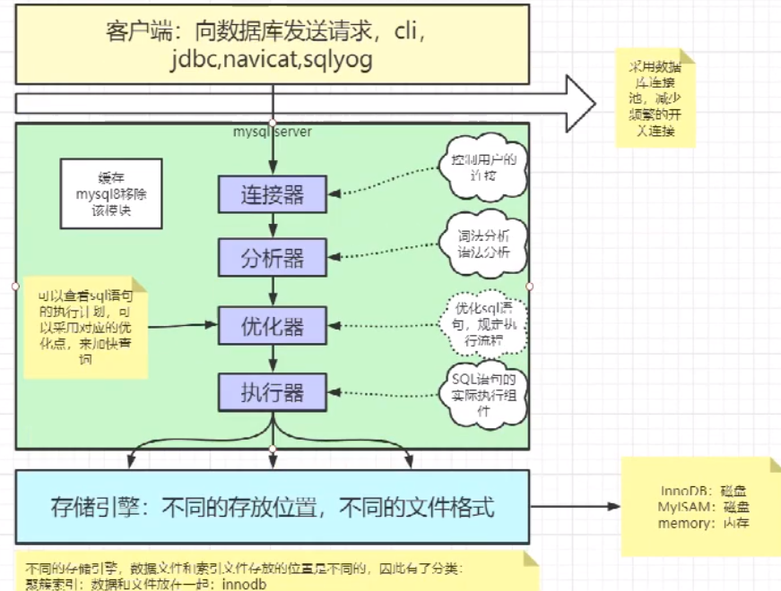

# 数据库的索引
[https://www.cs.usfca.edu/~galles/visualization/Algorithms.html](数据结构学习网站)
###### 索引是关系型数据库中给数据库表中一列或多列的值排序后的存储结构

### 一.索引分类

### 按索引存储分类

#### 1. 聚集（clustered）索引  innodb
###### 数据行的物理顺序与列值（一般是主键的那一列）的逻辑顺序相同，一个表中只能拥有一个聚集索引。
<pre>
聚集索引，该索引中键值的逻辑顺序决定了表中相应行的物理顺序。
聚集索引确定表中数据的物理顺序。聚集索引类似于电话簿，后者按姓氏排列数据。由于聚集索引规定数据在表中的物理存储顺序，因此一个表只能包含
聚集索引对于那些经常要搜索范围值的列特别有效
</pre>

#### 2. 非聚集索引 myisam
 
<pre>
该索引中索引的逻辑顺序与磁盘上行的物理存储顺序不同。
索引是通过二叉树的数据结构来描述的
</pre>
###### 聚簇索引,索引的叶节点就是数据节点。而非聚簇索引的叶节点仍然是索引节点，只不过有一个指针指向对应的数据块

#### 按使用来分

#### 1. 唯一索引
###### 唯一索引可以有多个但索引列的值必须唯一，索引列的值允许有空值
<pre>
唯一索引是可以为null，但是不可以重复
唯一索引可以保证数据记录的唯一性
</pre>
```sql
CREATE UNIQUE INDEX name ON table (column [, ...]);
```
#### 2. 主键索引
#### 3. 普通索引
* 回表： 通过普通索引去书树查找返回主键， 更具主键去索引树查找数据 （innodb索引表和数据在同一文件中及数据存在叶子节点中所以才发生回表）
* 覆盖索引： myisam中存在, myisam索引表和数据存放在不同的文件中 B+Tree叶子结点存储量了数据的地址, 找到地址之后要到数据文件中去找具体的数据文件

#### 4. 组合索引
存在最左匹配问题， 因为组合索引按条件顺序来查 
###### 组合索引，即一个索引包含多个列
#### 5. 全文索引


目前，只有 B-tree 索引可以声明为唯一
<pre>
索引的使用范围:单一列索引可以出现在where 条件中的任何位置,而联合索引需要按一定的顺序来写.
</pre>

### 二. 索引的数据结构
    * hash
    * 二叉树
    * B树
    * B+树
###### mysql 中采用 B+树
* B树

> B树一定是一个平衡树



* B+树
> mysql InnoDB B+Tree中叶子节点直接放数据
> 叶子节点之间是双向链表
> B+Tree 两种查找 一种是对于主键的范围查找和分页查找， 另一种是从更节点开始进行随机查找



### 索引的优点：


###  索引的缺点


### 索引失效
>1、 like 以%开头，索引无效；当like前缀没有%，后缀有%时，索引有效。
>
>2、 or语句前后没有同时使用索引。当or左右查询字段只有一个是索引，该索引失效，只有当or左右查询字段均为索引时，才会生效
>
>3、组合索引，不是使用第一列索引，索引失效。
>
>4、数据类型出现隐式转化。如varchar不加单引号的话可能会自动转换为int型，使索引无效，产生全表扫描。
>
>5、在索引列上使用 IS NULL 或 IS NOT NULL操作。索引是不索引空值的，所以这样的操作不能使用索引，可以用其他的办法处理，例如：数字类型，判断大于0，字符串类型设置一个默认值，判断是否等于默认值即可。（此处是错误的！）
>
>6、在索引字段上使用not，<>，!=。不等于操作符是永远不会用到索引的，因此对它的处理只会产生全表扫描。 优化方法： key<>0 改为 key>0 or key<0。
>
>7、对索引字段进行计算操作、字段上使用函数。（索引为 emp(ename,empno,sal)）
>
>8、当全表扫描速度比索引速度快时，mysql会使用全表扫描，此时索引失效。


### mysql 结构

